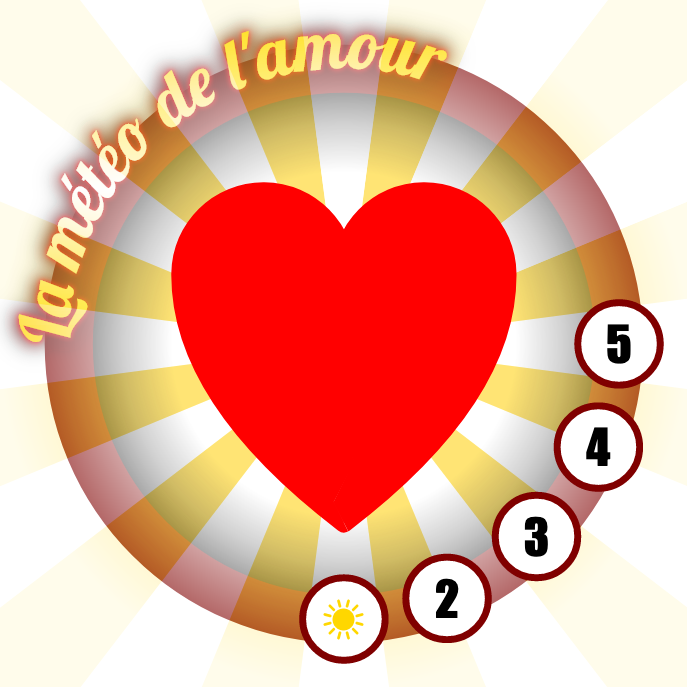

# SVG à la main, toi aussi tu peux le faire

Atelier présenté à Paris Web 2019, l'objectif est d'explorer comment créer du SVG à la main.


## Démarrage

Ce dépôt GIT contient tous les exercices pour arriver à produire cette image interactive :



Vous voyez actuellement un petite partie du résultat final auquel vous allez arriver. Pour suivre les exercices étape par étape commencez par cloner ce dépôt :

```bash
git clone https://github.com/JeremiePat/atelier-svg.git
```

Ensuite, accéder à chaque étape pour voir ses instructions et comment le code évolue :

```bash
# Démarrer un nouvel exercice
git checkout ex.001

# Voir la solution de l'exercice
git checkout ex.001.solution
```

Chaque étape correspond à un tag au format `ex.XXX` ou XXX est le numéro de l'étape à laquelle vous souhaitez accéder (préfixé par `0` autant que nécessaire).

Tout ce passe ensuite dans le dossier `exercice`. Vous y trouverez :

  - un dossier `code` qui est votre répertoire de travail.
  - un dossier README.md qui contient les instruction de l'exercice
  - un dossier `base` qui vous propose une base de code pour démarrer l'exercice (vous pouvez la copier dans le dossier `code` si vous le souhaitez)
  - un dossier `solution` qui contient la solution de l'exercice (_ce dossier n'est présent que si vous checkout un tag `ex.XXX.solution`_)

A partir de là, c'est à vous de jouer. Prenez votre temps, comprenez ce que vous faites et amusez vous bien 😁
